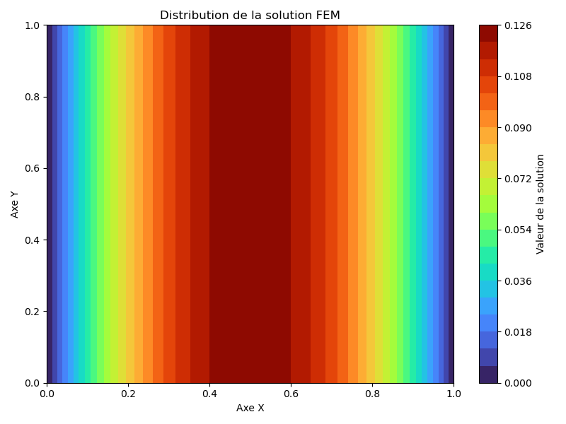
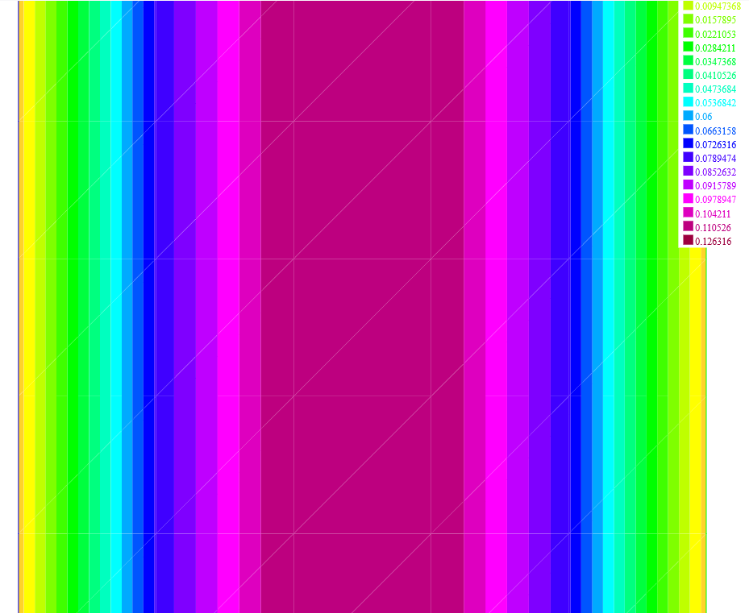

# FEM_2D

Implémentation **from scratch** d’une méthode des éléments finis (FEM) en 2D,  
résolvant le problème de Poisson avec second membre `f = 1` et conditions de Dirichlet sur les bords.

---

## Objectif
- Créer un solveur FEM pédagogique et modulaire en Python.
- Permettre une comparaison simple avec un solveur existant (**FreeFem**).
- Offrir une architecture claire et extensible pour d’autres problèmes physiques.

## 📊 Comparaison avec FreeFem

  
  

## Convergence

Test réalisé en prenant $f(x,y)=2 \pi^2 sin(\pi x)sin(\pi y)$  

  

